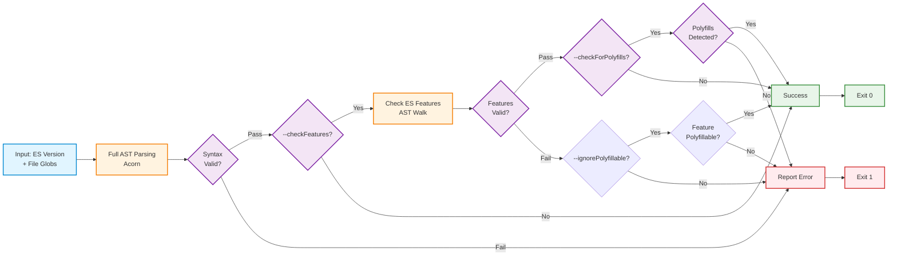

<p align="center">
  
</p>

---

<p align="center">Check JavaScript files ES version against a specified ES version 🏆</p>

---

# ES Check ✔️

[](https://www.npmjs.com/package/es-check) [](https://codecov.io/gh/yowainwright/es-check)

---

**ES Check** validates JavaScript files against specified ECMAScript versions. Files failing version checks throw errors with detailed logging.

---

## Version 9 🎉

Version 9 adds ES version feature checks (`--checkFeatures`), browserslist integration (`--checkBrowser`), polyfill detection (`--checkForPolyfills`), and enhanced config support. Backward compatible.

### `--checkFeatures`

```sh
es-check es6 './dist/**/*.js' --checkFeatures
```

### `checkBrowser --browserslistQuery='<browserslist query>'`

```sh
es-check checkBrowser ./dist/**/*.js --browserslistQuery="last 2 versions"
```

---

<p align="center">
  <a href="#get-started">Get Started</a>&nbsp;&nbsp;
  <a href="#why-es-check">Why ES Check?</a>&nbsp;&nbsp;
  <a href="#api">API</a>&nbsp;&nbsp;
  <a href="#usage">Usage</a>&nbsp;&nbsp;
  <a href="#configuration">Configuration</a>&nbsp;&nbsp;
  <a href="#how-es-check-works">How ES Check Works</a>&nbsp;&nbsp;
  <a href="#contributing">Contributing</a>&nbsp;&nbsp;
  <a href="https://github.com/yowainwright/es-check/issues">Issues</a>
</p>

---

## Get Started

Install

```sh

npm i es-check --save-dev   # locally
npm i es-check -g           # or globally

```

Check if an array or glob of files matches a specified ES version.

- **Note:** adds quotation around globs. Globs are patterns like so, `<something>/*.js`.

```sh

es-check es5 './vendor/js/*.js' './dist/**/*.js'

```

- The ES Check script (above) checks `/dist/*.js` files to see if they're ES5. It throws an error and logs files are that do not pass the check.

---

## Why ES Check?

Modern JavaScript builds assume proper transpilation via tools like Babel. ES Check verifies transpilation succeeded, catching untranspiled files before production.

## What features does ES Check check for?

ES Check validates syntax by default. Add `--checkFeatures` for ES version-specific feature checking. View supported [features](./lib/constants/es-features/).

---

## Walk through

The images below demonstrate command line scripts and their corresponding logged results.

### Pass


### Fail


Run ES Check via CLI, npm scripts, CI tools, or programmatically in Node apps.

---

## API

```sh

# USAGE

es-check <ecmaVersion> [files...]

```

### Arguments

```sh

Usage: index [options] [ecmaVersion] [files...]

Arguments:
  ecmaVersion                         ecmaVersion to check files against. Can be: es3, es4, es5, es6/es2015, es7/es2016, es8/es2017, es9/es2018, es10/es2019, es11/es2020, es12/es2021,
                                      es13/es2022, es14/es2023, es15/es2024, es16/es2025
  files                               a glob of files to to test the EcmaScript version against

```

### Options

Here's a comprehensive list of all available options:

| Option                        | Description                                                                                                                 |
| ----------------------------- | --------------------------------------------------------------------------------------------------------------------------- |
| `-V, --version`               | Output the version number                                                                                                   |
| `--module`                    | Use ES modules (default: false)                                                                                             |
| `--allowHashBang`             | If the code starts with #! treat it as a comment (default: false)                                                           |
| `--typescript, --ts`          | Enable TypeScript file support (default: false)                                                                             |
| `--files <files>`             | A glob of files to test the ECMAScript version against (alias for [files...])                                               |
| `--not <files>`               | Folder or file names to skip                                                                                                |
| `--noColor`                   | Disable use of colors in output (default: false)                                                                            |
| `-v, --verbose`               | Verbose mode: will also output debug messages (default: false)                                                              |
| `--quiet`                     | Quiet mode: only displays warn and error messages (default: false)                                                          |
| `--looseGlobMatching`         | Doesn't fail if no files are found in some globs/files (default: false)                                                     |
| `--silent`                    | Silent mode: does not output anything, giving no indication of success or failure other than the exit code (default: false) |
| `--checkFeatures`             | Check for actual ES version specific features (default: false)                                                              |
| `--checkForPolyfills`         | Consider polyfills when checking features (only works with --checkFeatures) (default: false)                                |
| `--ignorePolyfillable [lib]`  | Ignore polyfillable features; optionally specify library (e.g., `core-js`) to limit scope                                   |
| `--ignore <features>`         | Comma-separated list of features to ignore, e.g., "ErrorCause,TopLevelAwait"                                                |
| `--ignoreFile <path>`         | Path to JSON file containing features to ignore                                                                             |
| `--allowList <features>`      | Comma-separated list of features to allow even in lower ES versions, e.g., "const,let"                                      |
| `--checkBrowser`              | Use browserslist configuration to determine ES version (default: false)                                                     |
| `--browserslistQuery <query>` | Custom browserslist query (e.g., "last 2 versions")                                                                         |
| `--browserslistPath <path>`   | Path to custom browserslist configuration (default: uses standard browserslist config resolution)                           |
| `--browserslistEnv <env>`     | Browserslist environment to use (default: production)                                                                       |
| `--config <path>`             | Path to custom .escheckrc config file                                                                                       |
| `--batchSize <number>`        | Number of files to process concurrently (0 for unlimited, default: 0)                                                       |
| `--noCache`                   | Disable file caching (cache is enabled by default)                                                                          |
| `-h, --help`                  | Display help for command                                                                                                    |

### Examples

**Using ES modules:**

```sh
es-check es6 './dist/**/*.js' --module
```

**Checking files with hash bang:**

```sh
es-check es6 './tests/*.js' --allowHashBang
```

**Checking TypeScript files:**

```sh
es-check es5 './src/**/*.{js,ts}' --typescript
```

This is experimental functionality that strips TypeScript type annotations and tests the resulting JavaScript against the specified ES version.

**Skipping specific files or directories:**

```sh
es-check es5 './dist/**/*.js' --not=./dist/vendor,./dist/polyfills
```

**Using the files option instead of arguments:**

```sh
es-check es6 --files=./dist/main.js,./dist/utils.js
```

⚠️ **NOTE:** Setting both the `[...files]` argument and `--files` flag is an error.

**Using loose glob matching:**

```sh
es-check es5 './dist/**/*.js' './optional/**/*.js' --looseGlobMatching
```

**Checking for ES version specific features:**

```sh
es-check es6 './dist/**/*.js' --checkFeatures
```

**Considering polyfills when checking features:**

```sh
es-check es2022 './dist/**/*.js' --checkFeatures --checkForPolyfills
```

**Using a custom config file:**

```sh
es-check --config=./configs/production.escheckrc.json
```

**Using a custom browserslist query:**

```sh
es-check --checkBrowser --browserslistQuery="last 2 versions" ./dist/**/*.js
```

**Using browserslist with custom query and feature checking:**

```sh
es-check --checkBrowser --browserslistQuery=">0.5%, not dead" --checkFeatures ./dist/**/*.js
```

**Using browserlist just like an es version**

```sh
es-check checkBrowser ./dist/**/*.js --browserslistQuery=">0.5%, not dead"
```

**Using browserlist with a pre-defined browserlist**

```sh
es-check checkBrowser ./dist/**/*.js
```

---

## Usage

ES Check is mainly a shell command CLI. It is run in [shell tool](http://linuxcommand.org/lc3_learning_the_shell.php) like Terminal, ITerm, or Hyper. It takes in two arguments: an [ECMAScript version](https://www.w3schools.com/js/js_versions.asp) (`<ECMAScript version>`) and files (`[files]`) in [globs](http://searchsecurity.techtarget.com/definition/globbing).

Here are some example of **es check** scripts that could be run:

```sh
# globs
es-check es6 ./js/*.js

# array of arguments
es-check es6 ./js/*.js ./dist/*.js
```

### Using ES Check in Node (Programmatic API)

In addition to its CLI utility, ES Check can be used programmatically in Node.js applications:

```javascript
const { runChecks, loadConfig } = require("es-check");

async function checkMyFiles() {
  const configs = [
    {
      ecmaVersion: "es5",
      files: ["dist/**/*.js"],
      module: false,
      checkFeatures: true,
    },
  ];

  const result = await runChecks(configs);

  if (result.success) {
    console.log("All files passed ES5 check!");
    // Output: All files passed ES5 check!
  } else {
    console.error(`ES Check failed with ${result.errors.length} errors`);
    result.errors.forEach((error) => {
      console.error(`- ${error.file}: ${error.err.message}`);
    });
    // Example output:
    // ES Check failed with 2 errors
    // - dist/app.js: Unsupported features used: const, arrow-functions but your target is ES5.
    // - dist/utils.js: Unsupported features used: template-literals but your target is ES5.
  }

  return result;
}
```

---

## Configuration

If you're using a consistent configuration, you can create a `.escheckrc` file in JSON format with the `ecmaVersion` and `files` arguments so you can conveniently run `es-check` standalone from the command line.

Here's an example of what an `.escheckrc` file will look like:

```json
{
  "ecmaVersion": "es6",
  "module": false,
  "files": "./dist/**/*.js",
  "not": ["./dist/skip/*.js"],
  "allowHashBang": false,
  "looseGlobMatching": false,
  "checkFeatures": true,
  "checkForPolyfills": true,
  "ignorePolyfillable": "core-js",
  "ignore": ["ErrorCause", "TopLevelAwait"],
  "allowList": ["ArrayToSorted", "ObjectHasOwn"],
  "checkBrowser": false,
  "browserslistQuery": "last 2 versions",
  "browserslistPath": "./config/.browserslistrc",
  "browserslistEnv": "production"
}
```

### Configuration Options

| Option              | Type            | Description                                                        |
| ------------------- | --------------- | ------------------------------------------------------------------ |
| `ecmaVersion`       | String          | ECMAScript version to check against (e.g., "es5", "es6", "es2020") |
| `files`             | String or Array | Files or glob patterns to check                                    |
| `module`            | Boolean         | Whether to parse files as ES modules                               |
| `not`               | Array           | Files or glob patterns to exclude                                  |
| `allowHashBang`     | Boolean         | Whether to allow hash bang in files                                |
| `looseGlobMatching` | Boolean         | Whether to ignore missing files in globs                           |
| `checkFeatures`     | Boolean         | Whether to check for ES version specific features                  |
| `checkForPolyfills` | Boolean         | Whether to consider polyfills when checking features               |
| `ignorePolyfillable`| Boolean/String  | Ignore polyfillable features; set to library name (e.g., `"core-js"`) to limit scope |
| `ignore`            | Array           | Features to ignore when checking                                   |
| `allowList`         | Array           | Features to allow even in lower ES versions                        |
| `checkBrowser`      | Boolean         | Whether to use browserslist configuration to determine ES version  |
| `browserslistQuery` | String          | Custom browserslist query to use                                   |
| `browserslistPath`  | String          | Path to custom browserslist configuration                          |
| `browserslistEnv`   | String          | Browserslist environment to use                                    |

### Multiple Configurations

For projects with multiple bundle types (like UMD, CJS, and ESM), you can specify different configurations using an array:

```json
[
  {
    "ecmaVersion": "es6",
    "module": false,
    "files": "{cjs,umd}/index.{cjs,js}"
  },
  {
    "ecmaVersion": "es2020",
    "module": true,
    "files": "esm/index.mjs",
    "checkFeatures": true
  },
  {
    "files": "legacy/*.js",
    "checkBrowser": true,
    "browserslistEnv": "legacy"
  }
]
```

### Custom Config Path

⚠️ **NOTE:** Using command line arguments while there is an `.escheckrc` file in the project directory will override all configurations in `.escheckrc`.

You can also specify a custom config file path using the `--config` option:

```sh
es-check --config=./configs/my-custom-config.json
```

This is useful for projects that need different configurations for different environments or test scenarios.

## Debugging

As of ES-Check version **2.0.2**, a better debugging interface is provided. When a file errors, An error object will be logged with:

- the erroring file
- the error
- the error stack

⚠️ **NOTE:** Error logs are from the Acorn parser while parsing JavaScript related to specific versions of ECMAScript. This means error messaging is not specific to ECMAScript version. It still offers context into parsing issues!

---

## Ignoring Features

Sometimes you may need to temporarily ignore certain feature detections while working on fixes. ES Check provides two ways to ignore features:

1. Via command line:

```sh
es-check es6 './dist/**/*.js' --checkFeatures --ignore="ErrorCause,TopLevelAwait"
```

1. Via ignore file:

```sh
es-check es6 './dist/**/*.js' --checkFeatures --ignoreFile=".escheckignore"
```

Example `.escheckignore` file:

```json
{
  "features": ["ErrorCause", "TopLevelAwait"]
}
```

⚠️ **NOTE:** The ignore feature is intended as a temporary solution while working on fixes. It's recommended to remove ignored features once the underlying issues are resolved.

---

## Polyfill Detection

When using polyfills like core-js to add support for modern JavaScript features in older environments, you might encounter false positives with the `--checkFeatures` flag. ES Check provides the `--checkForPolyfills` option to handle this scenario:

```sh
es-check es2022 './dist/**/*.js' --checkFeatures --checkForPolyfills
```

This option tells ES Check to look for common polyfill patterns in your code and avoid flagging features that have been polyfilled. Currently, it supports detection of:

- Core-js polyfills (both direct usage and imports)
- Common polyfill patterns for Array, String, Object, Promise, and RegExp methods

### Comparing Polyfill Handling Options

ES Check provides three ways to handle polyfilled features:

1. **--checkForPolyfills**: Automatically detects polyfills in your code

   ```sh
   es-check es2022 './dist/**/*.js' --checkFeatures --checkForPolyfills
   ```

2. **--allowList**: Explicitly specify features to allow regardless of ES version

   ```sh
   es-check es2022 './dist/**/*.js' --checkFeatures --allowList="ArrayToSorted,ObjectHasOwn"
   ```

3. **--ignorePolyfillable**: Ignore all features that can be polyfilled (or limit to a specific library)

   ```sh
   # Ignore all polyfillable features
   es-check es2017 './dist/**/*.js' --checkFeatures --ignorePolyfillable

   # Ignore only features polyfillable by core-js
   es-check es2017 './dist/**/*.js' --checkFeatures --ignorePolyfillable=core-js
   ```

4. **--allowList**: Explicitly specify features to allow regardless of ES version

   ```sh
   es-check es2022 './dist/**/*.js' --checkFeatures --allowList="ArrayToSorted,ObjectHasOwn"
   ```

5. **--ignore**: Completely ignore specific features during checking
   ```sh
   es-check es2022 './dist/**/*.js' --checkFeatures --ignore="ArrayToSorted,ObjectHasOwn"
   ```

#### When to use each option:

- Use `--checkForPolyfills` when you have a standard polyfill setup (like core-js) and want automatic detection
- Use `--ignorePolyfillable` when you know polyfills are provided externally and don't want to flag polyfillable features
- Use `--allowList` when you have custom polyfills or want to be explicit about which features are allowed
- Use `--ignore` as a temporary solution when you're working on fixes

⚠️ **NOTE:** The polyfill detection is not exhaustive and may not catch all polyfill patterns. For complex polyfill setups, you might need to combine it with `--allowList`.

---

## Browserslist Integration

ES-Check can use your project's browserslist configuration to automatically determine which ES version to check against:

```sh
# Using --checkBrowser flag with browserslist query
es-check --checkBrowser --browserslistQuery="last 2 versions" ./dist/**/*.js

# Using 'checkBrowser' as the ES version argument
es-check checkBrowser --browserslistQuery="last 2 versions" ./dist/**/*.js

# Using a pre-defined browserslist configuration
es-check checkBrowser ./dist/**/*.js
```

This will read your browserslist configuration (from `.browserslistrc`, `package.json`, etc.) and determine the appropriate ES version based on your targeted browsers.

### Examples with Browserslist

**Using a custom browserslist query:**

```sh
es-check --checkBrowser --browserslistQuery="last 2 versions" ./dist/**/*.js
```

**Using a specific browserslist environment:**

```sh
es-check --checkBrowser --browserslistEnv="production" ./dist/**/*.js
```

**Combining with feature checking:**

```sh
es-check --checkBrowser --checkFeatures ./dist/**/*.js
```

⚠️ **NOTE:** When using `--checkBrowser`, you must also provide a `--browserslistQuery` or have a valid browserslist configuration in your project. You cannot have a files directly after your `--checkBrowser` option; it will read as

---

## Performance Optimization

ES Check includes several performance optimizations:

### File Caching

File caching is **enabled by default** for faster re-checking:

```sh
# Cache is enabled by default
es-check es5 './dist/**/*.js'

# Disable cache if needed
es-check es5 './dist/**/*.js' --noCache
```

We observed ~28% performance improvement in our [benchmark tests](./benchmarks/README.md). Your results may vary based on file sizes and system configuration. Try the benchmarks yourself:

```sh
node benchmarks/compare-tools.js 3 ./benchmarks/test-files
```

### Batch Processing

The `--batchSize` option optimizes memory usage:

```sh
# Process all files in parallel (default)
es-check es5 './dist/**/*.js' --batchSize 0

# Process 10 files at a time (memory-constrained environments)
es-check es5 './dist/**/*.js' --batchSize 10

# Process 50 files at a time (balanced approach)
es-check es5 './dist/**/*.js' --batchSize 50
```

### Performance Guidelines

| Scenario                         | Recommended `--batchSize` | Reason                                  |
| -------------------------------- | ------------------------- | --------------------------------------- |
| Small codebases (< 100 files)    | `0` (unlimited)           | Maximum parallelism for fastest results |
| Medium codebases (100-500 files) | `0` or `50`               | Balance between speed and memory        |
| Large codebases (> 500 files)    | `50-100`                  | Prevent memory spikes                   |
| CI/CD with limited memory        | `10-20`                   | Conservative memory usage               |
| Local development                | `0` (default)             | Utilize available hardware              |

### Recent Performance Improvements

As of August 2025, ES Check has been optimized with:

- **Single-parse optimization**: Files are parsed once and the AST is reused
- **Async file processing**: Non-blocking I/O for better performance
- **Configurable batch processing**: Fine-tune based on your needs

---

## Checking node_modules Dependencies

To check node_modules dependencies for ES compatibility:

```sh
// Check a specific package
npx es-check es5 ./node_modules/some-package/dist/index.js

// Check all JS files in node_modules
npx es-check es5 './node_modules/**/*.js'
```

A simple example script is available in `examples/check-node-modules.js`.

---

## How ES Check Works



---

## Source Maps

ES Check supports source maps for better error reporting. When a `.map` file exists alongside your JavaScript file, ES Check will automatically map error positions from transpiled code back to the original source:

```sh
es-check es5 './dist/bundle.js'
```

If `bundle.js.map` exists, errors will reference the original source file and line numbers instead of the minified positions. This helps quickly identify issues in your source code.

---

## Shell Completion

ES Check supports shell tab completion for commands and options. You can generate completion scripts for bash and zsh shells:

```sh
# Generate completion script for bash (default)
es-check completion

# Generate completion script for zsh
es-check completion zsh
```

To enable completions in your shell:

**Bash:**

```sh
# Add to ~/.bashrc or ~/.bash_profile
es-check completion > ~/.es-check-completion.bash
echo 'source ~/.es-check-completion.bash' >> ~/.bashrc
```

**Zsh:**

```sh
# Add to ~/.zshrc
es-check completion zsh > ~/.es-check-completion.zsh
echo 'source ~/.es-check-completion.zsh' >> ~/.zshrc
```

Once enabled, you can use tab completion for:

- ES versions (es5, es6, etc.)
- Commands (completion)
- Options (--module, --checkFeatures, etc.)
- File paths

---

## Performance

ES Check is benchmarked against similar tools using real-world production libraries. Results from 11/02/2025:

| Tool                  | Average (ms) | Relative Performance |
| --------------------- | ------------ | -------------------- |
| **es-check-batch-50** | **7.20**     | **1x (fastest)**     |
| es-check-batch-10     | 7.67         | 1.06x slower         |
| es-check-bundled      | 8.04         | 1.12x slower         |
| es-check              | 9.17         | 1.27x slower         |
| are-you-es5           | 15.05        | 2.09x slower         |
| acorn (direct)        | 47.11        | 6.54x slower         |
| eslint                | 55.21        | 7.67x slower         |
| swc/core              | 55.69        | 7.73x slower         |
| babel-parser          | 65.00        | 9.03x slower         |

Tested on lodash, axios, react, moment, express, and chalk. See [benchmarks](./tests/benchmarks/README.md) for details.

---

## Contributing

ES Check has only 3 core dependencies: [acorn](https://github.com/ternjs/acorn/) for JavaScript parsing, [fast-glob](https://github.com/mrmlnc/fast-glob) for file globbing, and [browserslist](https://github.com/browserslist/browserslist) for browser targeting.

The CLI, logging, and source map support are implemented with custom lightweight solutions using Node.js built-ins to minimize dependencies. To contribute, file an [issue](https://github.com/yowainwright/es-check/issues) or submit a pull request.

### Contributing to ES Features

To update ES version support:

- Update [ES version mappings](./lib/constants/versions.js)
- Reference [Acorn ES version support](https://github.com/acornjs/acorn/blob/3221fa54f9dea30338228b97210c4f1fd332652d/acorn/src/acorn.d.ts#L586)

To update ES feature detection:

- Add features to [version-specific files](./lib/constants/es-features/) (e.g., `6.js` for ES6 features)
- Update [polyfill patterns](./lib/constants/es-features/polyfills.js) if needed
- Feature detection uses AST traversal via [Acorn](https://github.com/acornjs/acorn/)

Tests are located in `tests/unit/` and mirror the `lib/` structure. Please add tests for new features!

### Contributors

- [Jeff Wainwright](https://github.com/yowainwright/)
- [Brian Gonzalez](https://github.com/briangonzalez/)
- [Jon Ong](https://github.com/jonathanong/)
- [Suhas Karanth](https://github.com/sudo-suhas)
- [Ben Junya](https://github.com/MrBenJ)
- [Jeff Barczewski](https://github.com/jeffbski)
- [Brandon Casey](https://github.com/BrandonOCasey)

---

## License

[MIT](./LICENSE) © [Jeff Wainwright](https://github.com/yowainwright)
